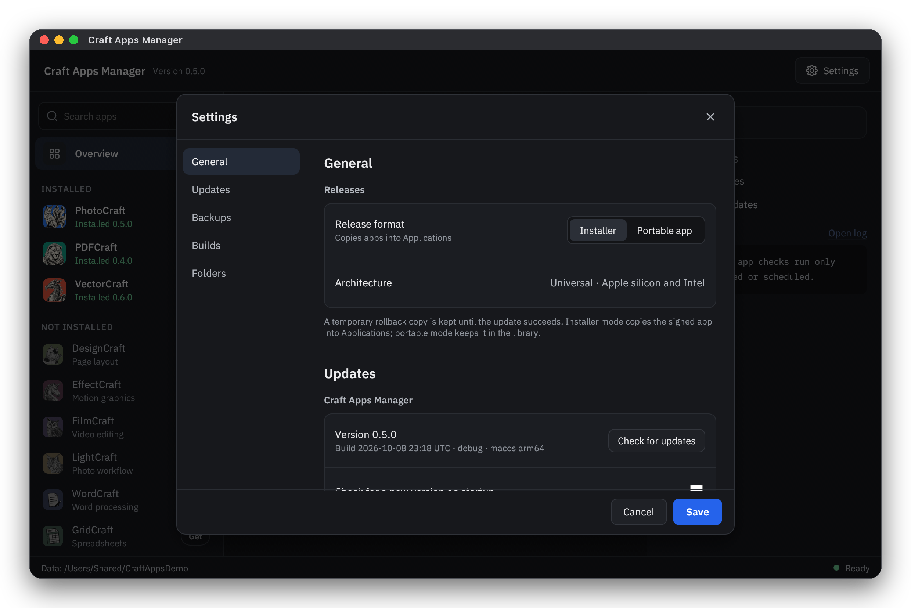
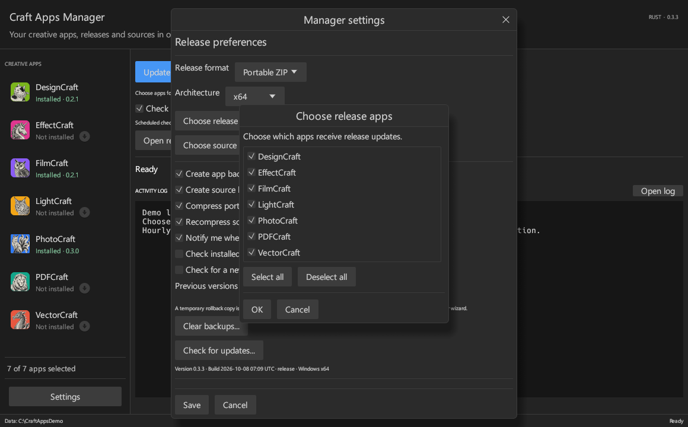
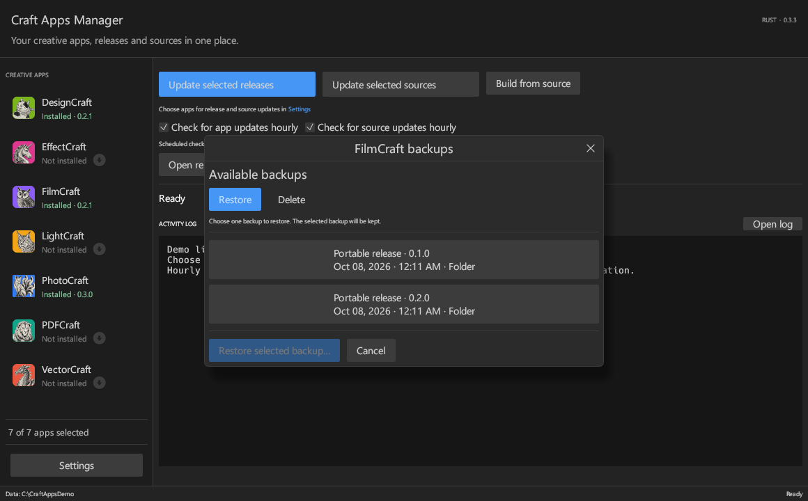

# Craft Apps Updater

A Windows app for downloading, updating, and building the Craft apps from Storytold. I made this to keep the apps, source downloads, and builds in one place without having to manage every release by hand.

The interface is written in Rust and uses a compact dark theme. This is an independent project, not an official Storytold or Adobe app.

## Video tour

https://github.com/user-attachments/assets/9d39928a-3c10-43dd-a813-40183dcaeb27

A short look at app controls, backups, settings, and the source builder.

[Download the latest release](https://github.com/CryptoKey98/craft-apps-updater/releases/latest)

The video and screenshots use an example library. Music: Prelude in C major, BWV 846, by Bach, performed by Kimiko Ishizaka ([CC0 recording and credit](docs/media/music-credit.txt)).

<details>
<summary>More screenshots</summary>

**Settings** — choose release formats, backup preferences, and updater checks.



**App selection** — choose which apps receive release updates. Source updates have their own selection.



**Backups** — browse previous versions and choose restore or delete mode.



</details>

## Getting started

Download the Windows ZIP matching your system (x64 for 64-bit Windows, x86 for 32-bit Windows) from this repository's Releases page, extract it, and open `CraftApps-Updater.exe`. Keep the bundled `workspace/tools/7zip` folder with the app. You don't need Rust or a separate 7-Zip installation to use the updater.

The current release is **0.3.1**, available for Windows x64 and x86. Both packages have been tested on 64-bit Windows; native 32-bit Windows testing is still pending. Expect some rough edges, especially around installers and building upstream projects.

## Supported apps

DesignCraft, EffectCraft, FilmCraft, LightCraft, PhotoCraft, PDFCraft, and VectorCraft are available for release and source updates. ArtCraft X is available for source updates and builds.

PDFCraft's repository was renamed from PrintCraft. Some of its release files and executable names still use `printcraft`; the updater handles that difference.

## Updating apps

Click an app in the sidebar to open its controls. Clicking the same row again closes the panel.

- **Install (latest release)** downloads and installs that app using the format selected in Settings.
- **Check for updates** checks one installed app. If a newer release exists, the button changes to **Update (latest release)**.
- **Launch settings** lets you choose the executable and add arguments, one per line.
- **Uninstall** removes a managed portable copy or opens its MSI uninstaller. Other installer types use Windows Installed apps.

The uninstall confirmation has an optional **Delete app profile data** checkbox, off by default. It lists the app-specific profile folders that can be removed after uninstall succeeds, including settings, caches, plug-ins and recovery/autosave copies. Some portable and installer copies share the same AppData profile. Custom profile locations outside the listed folders are kept. Portable PhotoCraft profiles are retained in `runtime/app-profiles` when the checkbox is off and restored when that portable app is installed again.

Installer is the default release format. Windows installer wizards may ask for administrator permission. Portable ZIPs are extracted into the app library. Portable and installer copies are tracked separately. Switching the release format selects the matching copy for Launch, update checks, and Uninstall; the other copy stays in place.

The two main update buttons have separate selections: use **Settings → Choose release apps** and **Settings → Choose source apps** to decide what each one updates. These selections also apply to automatic updates.

Opening the app or selecting a row does not check Craft app releases on GitHub. Manual checks use a short cache to avoid repeated requests. Optional automatic updates run hourly and after sign-in. Installer updates require an interactive session; background tasks do not open installer wizards.

Settings also has a separate check for this updater itself. Startup checks are off by default. Enable them to check for a newer stable release matching the updater's architecture when it opens. Nothing downloads until you confirm **Download and restart**. The package is verified against GitHub's published SHA-256 digest before a native helper replaces the EXE. Close other updater and builder windows first. Your library and settings stay in place, and the previous EXE is retained under `runtime/self-update` for recovery.

## Building from source

Open **Build from source**, select an app, and use **Set up build tools** before building. The setup installs only the extra tools needed for that app. Source builds currently require 64-bit Windows, even with the x86 updater. App and source updates work with either updater architecture. Rust builds require Microsoft's C++ build tools; ArtCraft X also needs its frontend tools.

The builder uses the upstream source and lockfiles without dependency patches. Build output appears in `builds`, and the log remains available when you reopen the builder. Failed or canceled builds keep their cache so you can try again. Successful-build cleanup is configurable.

Upstream build failures can still happen. Warnings from an upstream project are shown in the log rather than hidden or patched away.

## Files and backups

The app keeps its library beside the executable by default:

```text
releases/           Portable apps and downloaded installers
sources/            Source ZIPs and their index
builds/             Finished builds, grouped by app
logs/               Update and build logs
backups/releases/   Portable app backups
backups/sources/    Source backups
workspace/          Build tools, extracted sources, and build cache
runtime/            Download staging and internal state
```

You can change the library and build-tool locations in Settings. The change applies when you reopen the window.

Portable and source backups are optional. Compression uses 7-Zip LZMA2; archives are verified before the original backup is removed. Windows installer installations are not backed up by this app. Logs rotate at the configured size instead of creating a new file for every build.

Each app panel has a **Backups** window with Restore and Delete modes. Restore lets you choose one release or source backup by version or commit, date, and format. Delete lets you select individual backups or all of that app's backups. Both actions require confirmation. Restore replaces the current managed copy and keeps the selected backup. To restore a portable release, select Portable ZIP in Settings first. Source backups can be restored in either mode. These controls do not restore or remove Windows installer installations.

## Building this updater

Install stable Rust and Microsoft's **Desktop development with C++** workload, including its x86 and x64 tools. Keep one source checkout and build each target separately:

```text
rustup target add x86_64-pc-windows-msvc i686-pc-windows-msvc
cargo build --release --locked --target x86_64-pc-windows-msvc
cargo build --release --locked --target i686-pc-windows-msvc
```

Executables are under `target/<target>/release`. Distribution folders are `dist/windows-x64` and `dist/windows-x86`; each contains its matching executable and portable 7-Zip. The builder uses the same executable with `--builder`. An x86 updater defaults to x86 Craft app releases and only accepts x86 self-update packages. A saved release architecture preference still takes precedence.

```text
cargo test --locked
cargo clippy --all-targets -- -D warnings
```

Some integration tests require local build tools and 7-Zip. Set `CRAFT_TEST_TOOLS` to their parent folder to run those checks. The tests don't install or uninstall your real apps.

## Reporting problems

Open an issue with the app version, the Craft app involved, and the relevant part of `logs/updates.log` or that app's build log. Remove personal paths or anything private before posting it.

## License

MIT. The bundled 7-Zip files have their own license notices. Craft apps and their branding belong to their respective authors.
